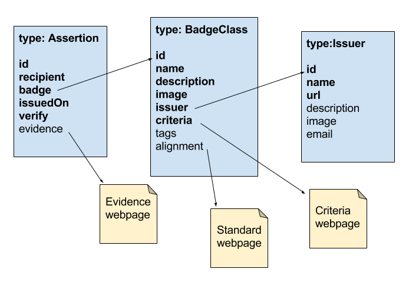

# {{ page.title }}

This guide was written for non-technical audiences as a companion to the Open Badges Technical Specification version 1.1. Thanks to [IMS Global](https://www.imsglobal.org/) for arranging contributions. This is an evolving document. Contributions welcome via filing an issue or pull request on the [openbadges-specification](https://github.com/openbadges/openbadges-specification) repository.

*Authors*:
Chris Crytzer, Badge Alliance
Steve Gance, Washington State Board for Community and Technical Colleges

## What are the differences between BadgeClass vs. Assertion vs. Evidence?

There are three core data classes defined by the Open Badges Specification, and three main types of external metadata URLs. 

### Badge Objects
The [BadgeClass](../#BadgeClass) describes a particular defined achievement and points to the Issuer who defined it with its issuer property.

An [Assertion](../#Assertion) contains information about a single Recipient’s achievement of a BadgeClass and similarly points to the BadgeClass’s identifying ID with the “badge” property.

The [Issuer Profile](../#Issuer) is uniquely identified by a Linked Data ID (which takes the form of an Internationalized Resource Identifier, specifically a URI). 

### External Metadata URLs
[Evidence](../#evidence) is linked as a URL from an Assertion. It is assumed to be human-readable, meaning that a person must view and interpret the response from the evidence URL.

[Criteria](../#criteria) is linked as a URL from a BadgeClass. It is the human-readable record of what must be done to earn the badge. Machines are assumed to be unable to fully interpret the response from the criteria URL.

An [Alignment URL](../#Alignment) is the canonical identifier for an objective targeted by a BadgeClass, such as an element of an educational standard, or a competency definition used by multiple organizations. The response from this URL is not assumed to be machine-interpretable.

Here's an image showing how these pieces fit together in the current (v1.1) specification:

## Baking

Refers to: [Badge Baking Specification](../baking/)

### How/when does the information in a baked badge get extracted?

The metadata is extracted during the verification process when:

+ A badge is uploaded to a backpack; or 
+ Recipients present earned badges to Consumers/Displayers using a software platform that showcases the data, which can be parsed. 

How the badge data is stored in an image varies by file format. SVG is an XML-based format, so the Assertion is added to the image using a custom XML tag, which is the typical way to add information to XML documents. PNG is a file format that uses “chunks” to organize different types of data within the image. Open Badges uses an “iTXt” type chunk, which is a type dedicated to adding textual content to an image. This textual content is not displayed by normal PNG rendering.

### When I see a badge image, how can I tell whether it’s a baked Open Badge or not an Open Badge?

Using the [Open Badges bakery service](http://bakery.openbadges.org/) from your browser, you can “unbake” the baked image and extract the data. If unsuccessful, the badge isn’t a baked Open Badge.

On a local machine, to extract the Assertion data from an existing baked badge, you can use the [Open Badges image baking library](https://github.com/mozilla/openbadges-bakery) command line. 

The Open Badges community is looking into more easily-accessible options to ensure that badge inspectors know when they are encountering Open Badges and have quick access to the functions that open badges afford.

## What does Verification measure? What doesn't it measure?

Refers to: [Hosted Verification](../#hosted-verification)

Verifying Open Badges Assertions involves checking the JSON structure to ensure that the data conforms to the Open Badges Specification, that it was issued by the expected entity and awarded to the expected entity, that you have the most up-to-date representation of the metadata, and that it hasn’t been revoked. There are two main branches of verification techniques outlined in the specification: hosted and signed verification.

Current weaknesses with verification systems and the spec vary by verifying application, but include:

* Not checking to ensure Assertion, BadgeClass, and Issuer were published by the same entity.
* For signed Assertions, the spec doesn’t currently allow Issuers to declare a public key in the most meaningful location. Currently, the location of the public key is in the signed Assertion. A goal for the next release of the spec is to make the public key a property of the Issuer Profile. 

The Badge Alliance Standard Working Group is working to improve the specification to strengthen signed Assertions.

### What's the difference between Hosted and Signed verification?

Refers to: [Badge Verification](../#badge-verification)

**Hosted badges**:

* A full version of the badge resides on the web (hosting a JSON version of each badge object, Assertion, BadgeClass, and Issuer). 
* The Issuer doesn’t need to maintain records of each issuance of the badge. The Assertion can be verified at the URL provided in the [verification object](../#VerificationObject). Awarding badges are instances of the BadgeClass:
  - Issuer profile = one URL
  - BadgeClass = one URL
  - Assertion file = one URL (specific to the Recipient)
* The majority of badges being issued are hosted Assertions, which don't require key management and are generally considered safer.
* Security concerns with hosting: 
  - Portable references to files (instances) don’t take "source of truth" with it, but instead carry a link to it, so portable versions may not be assumed to be correct.
  - Hosted files may change after scanning by a verification service, and there are no mechanisms to determine when reverification should be performed.
  - Hosted servers may become unavailable over time, rendering badges unverifiable.

**Signed badges**:

* The Issuer profile is hosted (indicating Issuer ownership) = one URL
* The BadgeClass is also hosted = one URL
* The Assertion class isn’t hosted. Need to do key management:
  - The Assertion is baked into a portable image file with a digital signature that has a public key. Data is verified with a private key.
  - Assertion is the source of truth. The Recipient possesses the Assertion.
* Portable even if the server goes down and is more resilient to servers failing.
* Very few Issuers are using signed Assertions. Sometimes used when awarding a significant number of badges if the Issuer knows it won’t need to revoke them. To check that a badge hasn’t been revoked, use the revocation list.
* Security issues:
  - Need to check to make sure the key used for signing really belongs to the issuer.
  - Concerns if the Issuers' key is compromised.

The verification quality and strength are equal for hosted and signed badges, unless the Issuer's key is compromised. You need to clearly identify what attack vectors you're targeting, as attacks are possible for both. Reviewing the benefits, complexities, and costs for both options is recommended.

## Why Salt and Hash? 

Refers to: [Identity Object](../#a-ididentityobjectaidentityobject)

The recipient's identifier (typically their email address) may be obscured to prevent someone "picking up the badge on the street" from learning who the recipient is. This uses a Cryptographic Hash Function (see [Wikipedia](https://en.wikipedia.org/wiki/Cryptographic_hash_function)) to generate a string of characters from the identifier. Inspectors who know the input email address and the hash function used will always be able to verify whether the badge was issued to the identifier they expect. 

Add a "salt" to protect against a precomputed hash attack where an observer computes a large number of email addresses into hash values and then compares them to a large number of badges, possibly making connections between the two. A "salt" string makes the same email address into a different hash in different badges where it appears, so adding a salt makes it so an observer who possesses a large number of badges is unable to immediately determine which clusters were awarded to the same email address.

Salting and hashing the Recipient’s email address allows backpack services to confirm the Recipient without exposing their email address in the JSON file, but also allows this information to be public on evidence pages attached to badge instances so Consumers/Displayers can verify badge Recipients.

## What's the difference between data added using an Extension and data added without using the Extension system?

It’s the same type of information, but with [Extensions](../extensions/#), display platforms are more confident that they know how to handle the question because the Extension system adds context about what expected values are, and which fields are required to be present. A developer who adds Extension processing to a display platform will likely only need to add that data once.

### What’s the benefit of an Issuer publishing an extension to openbadgespec.org instead of publishing it on their own site.

../extensions/

For convenience. It’s a free service for discoverability. A commitment to long-term hosting is provided by the Badge Alliance. Implementers may not trust another service to host critical extension data for the long term, causing them not to implement the extension in their products.

### What's a JSON-LD Context?

Contexts appear in the [Assertion](../#Assertion), [BadgeClass](../#BadgeClass), [Issuer Profile](../#Issuer) core data classes, as well as in [Extensions](../Extension).

Open Badges, as of v1.1 may be expressed in JSON-LD, which is an enhancement to JSON to provide Linked Data capabilities. JSON-LD is designed around the concept of a "context" to provide additional mappings from JSON to a Resource Description Framework (RDF) model. The context links object properties in a JSON document to concepts in an [ontology](https://en.wikipedia.org/wiki/Ontology_(information_science)). In order to map the JSON-LD syntax to RDF, JSON-LD allows values to be coerced to a specified type or to be tagged with a language. A context can be embedded directly in a JSON-LD document or put into a separate file and referenced from different documents (from traditional JSON documents via an HTTP Link header).

## What’s the format of a Signed Badge? 

With a signed badge, the BadgeClass and Issuer organization are stored in hosted files, but the Assertion is represented by a JSON Web Signature (JWS) with 3 strings. A signed Assertion may be baked into an image.

Here’s what a JSON Web Signature looks like:

[Signed Badge](../#SignedBadge)
[Signed Badge Example](../examples/#SignedBadge)

Refers to: [Signed Verification](../#signed-verification)

To verify a badge Assertion delivered with signed verification, you need to decode it and unpack the JWS Payload (a Base64 encoded representation of the Assertion) in order to get to the badge Assertion structure. Then, the BadgeClass and Issuer Profile structures may be retrieved over HTTP. 

## Why embed the endorsed object in the Endorsement extension?
The [endorsement extension](../extensions/#Endorsement) helps ensure that consumers can tell when an object has been changed from the version that was endorsed. 

Examples:

* When the Issuer stops hosting it.
* Is hacked or modified to mean something different than what was endorsed.
* Small updates to spellings or metadata that don’t change the overall meaning.

## What does the HTTP Status Code mean for revoking hosted badges?

Refers to: [Revoking Badges](../#revoking)

The Open Badges Specification tells Issuers to provide a specific HTTP response for revoked badges. Assertions may be revoked by removing the hosted Assertion, but best practices indicate they should replace it with a revocation record confirming that there once was a valid assertion but it had been revoked.

To revoke a hosted badge, Issuers make the URL respond with an HTTP Status of `410 GONE`. This indicates a revoked badge Assertion resource.

## What’s the difference between a TypeValidation and FrameValidation?
Refers to [Extension Validation](../#validation-a-idvalidationa)
For Extensions, there are two methods an extension author can use to help a validator extract the appropriate section of the extended badge object to test against the extension’s defined JSON-schema. 

* TypeValidation instructs a validator to locate the section of the badge marked with the type indicated. 
* FrameValidation provides a JSON-LD frame, which when applied to the incoming badge object, returns a specific subset of the input data in the expected format. See the [JSON-LD Framing](http://json-ld.org/spec/latest/json-ld-framing/) specification.

TypeValidation is generally considered to be easier for a new extension author to understand, but FrameValidation may be easier to get predictable results.

## How does one contribute to the spec? A pull request? What's that?

Join the [Badge Alliance Standard Working Group](https://groups.google.com/forum/#!forum/openbadges-dev) to participate in the continuing development of the Open Badges Technical Specification. 

Official proposals are made by contributing a pull request on GitHub. Pull requests let you tell others about changes you've pushed to a GitHub repository. 

Go to the [Open Badges spec repository](https://github.com/openbadges/openbadges-specification), then fork the code, modify it, and save it back to your forked repository. Submit a pull request to the origin repository master branch to initiate a review of the proposed changes.

Once a pull request is sent, interested parties can review the set of changes and discuss potential modifications before deciding whether and how to integrate them. The Standard Working Group makes a call for consensus, and if successful, merges the proposed changes.

[More info on Contributing to Open Source on GitHub](https://guides.github.com/activities/contributing-to-open-source/)

© IMS Global and Badge Alliance. Released under a Creative Commons Attribution (CC-BY) 4.0 International License.
