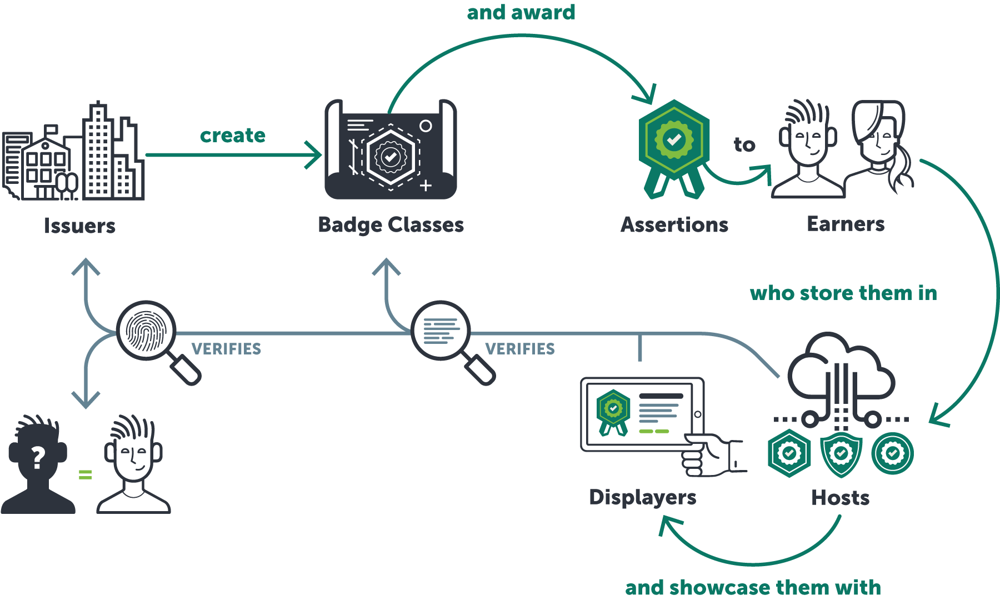

var md = `

##  Context
### Overview
Open Badges put learners in control of how and where they share verifiable evidence of their skills and achievements with people, organizations, and social platforms.

Open Badges enable learner-control of sharing their credentials and communicating their meaning to educational institutions and employers. These credentials show evidence of rigor of the academic achievement through the inclusion of criteria, assessment details, learner's evidence, alignment with external frameworks, accreditation details, and endorsements.

OBv2 introduces features that significantly improve the verifiability, portability, reliability, and discoverability of Open Badges.

## Use Cases
The following use cases are supported:

1. Creating a BadgeClass - BadgeClass objects can be created to build a catalog of badges that may be available to earn from the issuer. They may include information about the achievement including how to earn it or learn more about the issuer and achievement itself.
2. Issuing badge Assertions to recipients - With a catalog of badges (BadgeClasses) prepared, you can issue those badges to recipients by creating Assertion objects. The Assertion is the representation of an awarded badge and may include evidence and supporting information on how the recipient became eligible for it.
3. Displaying Open Badges - Typically, when an Open Badge is displayed, the Assertion and related objects are displayed on a screen in human-readable format. Supporting this enables the recipient to showcase their earned achievements and choose to allow others to view those.
4. Importing Open Badges - Badge Hosts must support the function of importing Open Badges. This involves a process by which an Assertion and related objects are validated for format and integrity. Import of Open Badge data normally results in the subsequent display of that data.

Starting with Open Badges 2.1, these additional use cases are supported by the Badge Connect API:

5. A recipient of an Assertion wants to import historically-issued badges into a chosen Host from an Issuer platform.
6. A user wishes to authorize an Issuer to push awarded Assertions to their chosen Host upon issue.
7. A user wishes to connect their Assertions to a recruiting platform.
8. A user wishes to move their badges from one Host to another Host.
9. A Relying Party wishes to obtain plaintext recipient identifier, to clearly understand the recipient profile in their badges.
10. An Issuer platform wishes to register a new recipient identifier on a recipient profile to which it would award badges.

## Recommended Practices
These recommended practices are in addition to the information provided in the specification document and certification requirements document. Please refer to each of these resources for comprehensive implementation details.

### Accessibility
- Ensure that the user interfaces of your platform are accessible to people with disabilities by following guidelines provided in [[[WCAG20]]].

### Badge Issuer
#### Issuing Badges
Creating Badge Classes
- Accessibility: Encouraging alt text for images - The Image data object contains a “Caption” property which can be rendered as alt text for images. Badge platforms should consider adding features that prompt users who create badge classes to submit Caption text to be used for this purpose. 
- Use of urn-based identifiers for embedded BadgeClasses presents a possibility that multiple data versions would be published under the same urn embedded in different Assertions. HTTP identifiers for BadgeClasses allows relying parties the best possible means to resolve possible differences to know which version best represents the current wishes of the issuer.

Delivering badges to recipients
- Typically, an Open Badge is made available to recipients through an email message or other notification that contains instructions and a mechanism for downloading the badge without signing up for any account. 

Recipient should be notified
- Any badge recipient should be notified when a badge is issued to them. Notification should contain details and/or a link to critical information about the badge. Allow for unsubscription of future notifications. Abuse prevention is key here. Allow recipients to opt out of email from your service permanently.

Claiming badges by recipient
- Badge earners should have agency in whether they accept the badge issued to them. Give earners the opportunity to choose to receive (“claim”) the badge if they desire. You may designate an issued badge as “not yet claimed” within your service. 
- Give recipients the choice to accept or reject the badge and options to express their acknowledgement or rejection. Rejection may mean deleting the badge and all associated data with it.
- Consider implementing a reminder process if a recipient has not claimed their badge. This applies to systems that have account management as a function. Important to respect opt-out choices here.
- Consider obtaining acceptance from the recipient before publishing a signed assertion which, unlike hosted assertions, cannot be unpublished. 
- Implement a process that enables the reporting of abusive content.
- Recipient identifier (email address or phone number) should be confirmed prior to the recipient doing other things with the badge like making it private or public.

Revoking badge assertions
- The revocation properties of Open Badges provide a mechanism by which a badge issuer may retract or nullify existing badge assertions. Revocation is an intentional act of a badge issuer and differs from the expiration date of a badge assertion, though both expiration and revocation are ways to communicate that the badge assertion is no longer current. 

Maintaining hosted resources for badge verification
- A critical feature of Open Badges is the ability for consumers to verify the badge. Maintain necessary hosted verification resources for the entire useful life of issued badges. This requires services to maintain a high level of availability. 
- Consider processes to prevent authorized BadgeClass owners from deleting existing BadgeClasses from which assertions have been issued. BadgeClasses are required resources for validating and verifying assertions. If the issuer does desire to invalidate all awarded assertions of the BadgeClass to be deleted, it is recommended to treat these assertions as revoked and supply a relevant revocationReason through the RevocationList or hosted Assertion verification URLs.

#### Publishing Badges
Expectations of publishing badges
  - The act of publishing a badge assertion means that the badge becomes a publicly accessible URL. 

Accessibility: Encouraging alt text for images
  - The Image data object contains a “Caption” property which can be rendered as alt text for images. If a badge contains Caption data, consider using it to populate an image’s alt text field. 

#### Ending Badge Services
When a badge service provider must close down its operations, there are a number of actions that are recommended to ensure continuity of service for the badge recipients. In order for previously-issued badges to remain valid, steps should be taken to ensure that those hosted resources that are necessary for the validation of the badges remain intact. If a badging service must be shut down, here are a number of actions to consider taking:
  - Move hosted assertions over to a new location and implement redirects.
  - Convert to signed assertions and redeliver to all recipients. (This will result in all previously hosted badges becoming invalid.)
  - Consider reissuing assertions using a different service or verification method that has less onerous persistent hosting requirements.

### Badge Displayer
General
  - Where possible, include contextual information on how to learn more about the Issuer, the Badge and possibly how to earn it.

Displaying Images
  - The Caption property of the Image class should be exposed as a caption or alt text on the page.
  - Image should be fully visible, not truncated or distorted. If provided,include caption as caption or alt text.

Displaying Recipient Name
  - If available and allowed by the badge recipient, the name of the recipient should be displayed. However, privacy considerations must be paramount. Publicly available badge assertions must only display recipients’ names following explicit permission of the recipient. Recipients must be able to change this setting at any time.
  - Recipient name is not part of the Assertion data itself, and the system should not trust name data unless it is also the issuing platform and that data was entered and verified by a trusted source like the issuer itself (alongside data that is served in the Assertion). If name is presented, the system should make clear to the viewer why it trusts this name to be associated with a specific Assertion.

Displaying Evidence
  - Provide convenient access to evidence. When possible, display multimedia evidence alongside the earned badge.

Displaying JSON
  - Provide access to the original JSON or full data of the badge.

Supporting Verification
  - Display the date of last verification.
  - Update system's verification record when viewers request reverification.
  - If the badge is not valid display human-readable error messages as best possible.
  - If the badge data is not available, consider use of “Could not verify” message to account for cases of temporary unavailability (like server outages). 
  - Provide options for retrying verification in the event a resource was missing or otherwise unavailable.
  - Nuanced user-friendly messages in UI are recommended for various types of http responses; e.g. 503 vs 404 vs 410 gone with revocation.

Updating Assertions - On occasion, an already-issued assertion must be updated (e.g. newly available evidence in a hosted assertion). Consider the following:
  - Updates should be reflected within the user-facing interface.
  - Display the last time the assertion and associated objects were fetched and/or updated.

### Badge Host
#### Hosting Badges
- Certification - Those interested in receiving IMS certification as Host should also strongly consider becoming certified as Displayer.
- Collections - Hosts should allow badge recipients to group badges into collections or pages to present the badges together.
- Extensions - Implement specific display functionality tailored to well-used extensions. 
- JSON availability - Make JSON available to consumers who wish to view it.

#### Importing Badges
- Allow importing of signed assertion strings.
- Helpful errors should be presented to the user in the event the import failed.

#### Sharing Badges
- Provide instructions on how to share your badge.
- Allow sharing to be retracted by the badge recipient.
- Recommended types of sharing options:
    <ul>
        <li>Download baked badge image file</li>
        <li>Social media integrations</li>
        <li>Copy URL to JSON assertion</li>
        <li>Retrieve HTML to display the badge</li>
    </ul>

### Other

#### Extensions
Creators of extensions are encouraged to submit extensions to the [public repository](https://github.com/IMSGlobal/openbadges-specification/tree/master/extensions) for review and feedback by the IMS workgroup. (Can also include a link to info on OB extensions and samples.)

#### Emerging Concepts and Concerns
Versioning
  - Badge Issuer: When a BadgeClass or Assertion is updated, use the version property to number your versions and provide references between them.
  - Badge Host: Implement "version" detection for imported badges and relate between them. 
  - Technical notes: There is much to be discovered about what a successful interaction between Issuer and Host for versioning BadgeClasses or Assertions looks like.

`;