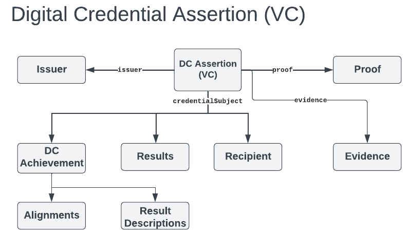

var introduction = `

## Introduction

### Specification Documents {#document-set}

The full set of documents is comprised of the following:

* [[[OB-30]]]
* [[[OB-CERT-30]]] - Specifies the conformance tests and certification requirements for this specification.
* [[[OB-BAKE-30]]] - Specifies how to embed Open Badge JSON inside a PNG or SVG image file.
* OpenAPI 3.0 Files for the Badge Connect API

  From the OpenAPI Specification [[OPENAPIS]],
  > The Open API Specification (OAS) defines a standard, programming language-agnostic interface description for HTTP APIs, which allows both humans and computers to discover and understand the capabilities of a service without requiring access to source code, additional documentation, or inspection of network traffic. When properly defined via OpenAPI, a consumer can understand and interact with the remote service with a minimal amount of implementation logic. Similar to what interface descriptions have done for lower-level programming, the OpenAPI Specification removes guesswork in calling a service.
  
  This standard has OpenAPI 3.0 files for the Badge Connect API in both JSON and YAML format:
  * [JSON OpenAPI File](https://purl.imsglobal.org/spec/ob/v2p1/schema/openapi/imsob_v3p0.json)
  * [YAML OpenAPI File](https://purl.imsglobal.org/spec/ob/v2p1/schema/openapi/imsob_v3p0.yaml)
  
* JSON-LD Context File

  From the JSON-LD 1.1 Specification [[json-ld11]],
  > When two people communicate with one another, the conversation takes place in a shared environment, typically called "the context of the conversation". This shared context allows the individuals to use shortcut terms, like the first name of a mutual friend, to communicate more quickly but without losing accuracy. A context in JSON-LD works in the same way. It allows two applications to use shortcut terms to communicate with one another more efficiently, but without losing accuracy.
  >
  > Simply speaking, a context is used to map terms to IRIs. Terms are case sensitive and any valid string that is not a reserved JSON-LD keyword can be used as a term.

  This specification includes this JSON-LD Context file:

  * [https://imsglobal.github.io/openbadges-specification/context.json](https://imsglobal.github.io/openbadges-specification/context.json)

* [[[OB-JSON-30]]]

### Terms

* _Achievement Type_: A vocabulary which describes the type of achievement.

* _Alignment_: An alignment is a reference to an achievement definition, whether referenced in a resource outside the package or contained within the package.

* _Association_: An association is the relationship between one assertion in a CLR has with another assertion in that CLR.
  
<a href="https://github.com/IMSGlobal/openbadges-specification/issues/324"><em>Association</em> needs review</a>.

* _Claim_: A statement about the Credential Subject. A claim may include associated evidence, results, or other metadata regarding a specific achievement, skill or assertion.

* _Comprehensive Learner Record (CLR)_: Set of assertions that can be packaged as a verifiable credential.

* _Credential Subject_: Describes the claims being made by the Verifiable Credential. In the context of Open Badges and CLR is typically  an individual but in the case of Open Badges, may be another entity type such as a course, book, or organization. Learners, Organizations and other entities can be explicit subclasses of Credential Subjects for purposes of business rules. [[vc-data-model]]

* _Decentralized Identifiers_: A type of identifier for people, organizations and any other entity, where each identifier is controlled independently of centralized registries. [[did-core]] [[did-use-cases]]

* _Digital Credential Achievement (DC Achievement)_: This is the content description of a credential that an assertion references. It contains metadata such as the name of the achievement, description, alignment of skills, etc. An Open Badge asserts a single achievement. A CLR asserts a collection of assertions, each of which asserts a single achievement.

* _Digital Credential Assertion (DC Assertion)_: The core of both Open Badges and CLR is the assertion about achievement(s). DC Assertion properties are specific to one learner's achievement and specify metadata such as issuer, date of achievement, expiration data, as well as results and evidence that support the assertion. A Verifiable Credential more broadly asserts a claim about a Credential Subject which can be applied to education and occupational achievements.

* _Evidence_: Information supporting a claim such as a URL to an artifact produced by the Learner.

* _Issuer_: The organization or entity that has made an assertion about a Credential Subject. The issuer of a DC Assertion is the authoritative source for that specific assertion.

* _Learner_: The person who is the subject of the CLR and assertions contained in a CLR.

* _Open Badge_: A single assertion of an achievement that is packaged as a verifiable credential.

* _Organization_: An organized group of one or more people with a particular purpose. [[CEDS]]

* _Person_: A human being, alive or deceased, as recognized by each jurisdiction’s legal definitions. [[CEDS]]

* _Publisher_: The organization or entity issuing the CLR (typically the educational institution or a 3rd-party agent). The publisher is either the issuer or has a trusted relationship with the issuer of all the assertions in the CLR.
  
<a href="https://github.com/IMSGlobal/openbadges-specification/issues/325"><em>Publisher</em> needs clarification</a>.

* _Relying Third-Party_: Also referred to as the "verifier" of a VC. This entity requests, verifies, and may consume data being presented.

* _Result_: Describes a possible achievement result. A result may contain the rubric level that was achieved.

* _Result Description_: Describes a possible achievement result. A result description may contain a rubric.

* _Rich Skill Descriptor (RSD)_: A machine readable reference to a description of a skill located at a unique URL. [[RSD]]

* _Role_: People have roles in organizations for specific periods of time. Roles are a time aware association between a person and an organization. [[CEDS]]

* _Rubric_: Defines levels associated with the achievement definition (e.g. "approaches", "meets", and "exceeds").

* _Skill Assertion_: An assertion that contains a "skill result."

* _Verifiable Credential (VC)_: A tamper-evident credential whose issuer can be cryptographically verified. See [[vc-data-model]].

* _Verifiable Presentation_: A tamper-evident presentation of one or more Verifiable Credentials of which cryptographic verification can be used to determine the trustworthiness of the authorship of the data. [[vc-data-model]]

### Conceptual Model

* I, issuer assert a claim about this Credential Subject that may describe an achievement, experience, membership, etc.,
  * The assertion provides the identity of the issuer, issuance date, and instructions on how to cryptographically prove the issuer identity and that the assertion and claim contents have not been tampered with since issuance.
    * The claim must contain a single Credential Subject which identifies the recipient of the Open Badge.
    * The claim may also contain: evidence of the achievement, and other properties supporting the achievement description.
    * The Achievement description is described using properties that may be shared with the CLR including, name, description, criteria, etc.

`;
