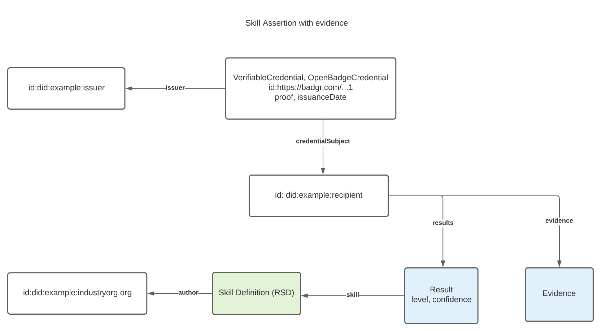
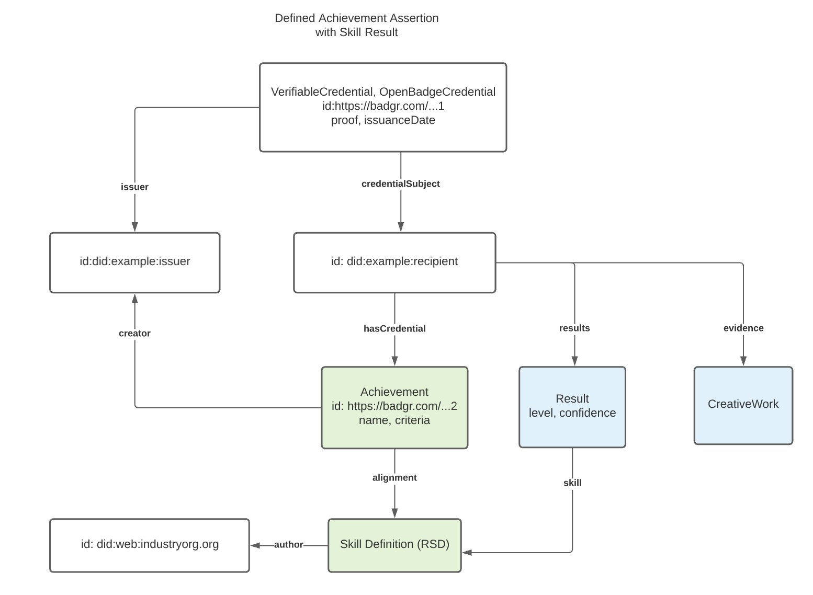

var overview=`

## Overview

### What is the problem this solves for?

Verifiable Credentials (VCs) are a format that is used to publish a limitless variety of [=claims=] about a [=subject=] person or other entity, typically through a cryptographic proof. VCs can be collected and delivered as part of a [=presentation=] whereby authorship of each VC from the same or multiple issuers can be trusted via cryptographic verification. The presentation can also be cryptographically signed to demonstrate that the [=holder=] has assembled and sent the collection of VCs.

These layers of cryptographic proof can provide security and privacy enhancements to Open Badges that were not available in version 2.0. Adoption of Verifiable Credentials will increase market penetration and use of Open Badges by addressing market needs for trustworthy machine-ready data to power connected ecosystems in education and workforce. This will unlock the door for Open Badges credentials to be included in a growing number of multi-purpose digital credential wallets entering the market. Stepping further into signed VCs and another associated technology, [[[DID-CORE]]], unlocks increased longevity and resilience of Open Badges that can describe achievements even more expressively than they do today.

### What does adopting Verifiable Credentials entail?

This specification changes the structure of the Open Badges [Assertion](#achievementcredential) class, to adopt the conventions of the [[[VC-DATA-MODEL]]]. This means that badges issued under this specification will not be conformant to all of the existing 2.x data model requirements.

Previous versions of an Open Badges Assertion, illustrated in the graphic below, structures its objects like this:
An Assertion identifies a recipient with a "recipient" relationship to an IdentityObject that contains identifying properties. It identifies which badge it represents with a "badge" relationship to a BadgeClass. It identifies its verification information with a "verification" relationship to a VerificationObject. It identifies its issuer with an "issuer" relationship between the BadgeClass and the Issuer.

<figure>
  
  <figcaption>Open Badges 2.0 Diagram</figcaption>
</figure>

The Verifiable Credentials structure in this specification depicted below offers the same information with a slightly different structure: A Verifiable Credential identifies its recipient with a "credentialSubject" relationship to a subject class that is identified by an identifier. It identifies its issuer with an "issuer" relationship directly to an Issuer. The Credential claims the subject has met the criteria of a specific Achievement (also known as the BadgeClass in previous versions) with an "achievement" relationship to that defined achievement. And it identifies its verification information with a proof.

<figure>
  
  <figcaption>Diagram show the major conceptual components of an Open Badge Verifiable Credential</figcaption>
</figure>

### Benefits and Opportunities

It can be risky to make breaking changes to a specification used as broadly as Open Badges, but there are a range of benefits to making this move now while the Verifiable Credentials ecosystem is young and growing fast. There are strong use cases for digital credentials for learning and skill achievements across the nexus of education and employment, as we have seen from the broad adoption of Open Badges and the proliferation of industry groups making connections between educational institutions and the employment market around digital credentials. Technical compatibility is in a more favorable position when faced with rapid ecosystem growth than competition between large communities issuing these learning credentials and other communities focused on different market verticals from government identity documents, commercial payments, and international trade, to name a few.

This specification opens a path forward for a unified concept of digital credentials in the IMS Global community, collapsing the relevant differences between Open Badges and Comprehensive Learner Record (CLR), and addressing a clear set of single achievement use cases with a robust, flexible, and future-proof solution that can easily be integrated with the set-of-multiple credentials use cases familiar to CLR.

Below, we present a selection of benefits related to this restructuring of Open Badges, and compare the opportunities opened by becoming compatible with Verifiable Credentials to the limitations that the Open Badges community has encountered with previous versions of Open Badges and CLR.

#### Interoperability with Digital Wallets, Verifiable Presentations, and Learner Experiences

Open Badges as VCs are designed to be issued and offered to learners who may accept them into their digital wallet. Wallets are software that runs on either the web or as a native app on a mobile device or desktop environment. A web wallet is another term to describe the application role known under [[OB-20]] as a "Host". There is an existing and growing ecosystem of deployed technology to support VCs; integration with these becomes possible with this specification. For example, a number of generic Verifiable Credential wallet implementations are available from a variety of vendors as native mobile apps. From a wallet, recipients may package their badges along with their other VCs into verifiable presentations. A presentation contains the credentials that the learner wishes to share with a relying party. The digital wallet application digitally signs the presentation using the key of the learner. The verifying third-parties can cryptographically verify that the presentation came unmodified directly from the credential holder as well as the integrity of each of the VCs included in the presentation as credentials signed by each of their respective issuers.

It is possible from a wallet to package credentials into a verifiable presentation in response to a request from a relying party who seeks credentials for a certain purpose. For example, a potential employer seeking to fill an internship role, may need to verify that a student is over 18, has completed a course on communication, and is a current student. A student could use their wallet to package three VCs (driver's license, course completion badge, and student ID) into a presentation that is signed by their private key. When the presentation is sent to the employer's website, the employer can verify that the VCs belong to the student and that the VCs are authentic.

The growing collection of VC wallets is an example of how adopting a Verifiable Credentials-based approach allows Open Badges to grow in impact and take advantage of existing momentum in the digital credentials space around tooling that is entering the market and heading towards maturity.

#### Verifiable Credentials Support Increases Learner Data Privacy and Trustworthiness of Open Badges

The [[[VC-DATA-MODEL]]] specification describes how technologies can be used to present cryptographically verifiable and tamper-evident claims. Verifiable Credentials (VCs) can be verified through up-to-date and broadly interoperable schemas for verification. This can provide security and privacy enhancements to [IMS Global Open Badges](https://openbadgespec.org) that are not available in Open Badges 2.0.

Currently, Open Badges 2.0 data can be verified via either (a) publicly accessible hosted JSON badge data or (b) JWS digitally signed badges with a limited number of algorithms and key types, depending on the verification method chosen by the issuer. In order to keep up with evolving cryptographic standards without taking on the burden of writing cryptographic suites as a community not specializing in that function, adopting Verifiable Credentials proofs will allow experts to update algorithms to keep up with improvements to cryptography-breaking processing power.

Publicly hosted badge data has been the preferred method of many Open Badges issuers. This method can risk the privacy of badge recipients who are reliant on the issuers to host their data leaving them with no direct control over its accessibility. There is also the potential that data about individuals is publicly accessible without their knowledge. Most Open Badges don't contain significant amounts of personally identifiable information, but they are subject to correlation. This could lead to on-site identification, email spam, and also cause badges to be correlatable with other personally identifying data on the web.

Hosted badge data is also not tamper-evident since it is hosted on web servers typically as dynamically-generated JSON files populated by queries made to relational databases or static JSON files. This makes the data easy to change without any historic reference or preservation. This can be convenient for issuers but not assuring for relying third-parties seeking to put the data to use. Changes to badge metadata such as criteria, the issue date, and recipient email can reduce the perceived quality of data and reflect incorrect information about the learners' experiences. Digitally signed 2.0 badges provide more assurances and privacy than the hosted badges but are not commonly issued and are not interoperable with VC wallets.

There's been very little evidence that badge JSON data has been readily consumed by machines, but technologies and the education and workforce markets have evolved since [[[OB-20]]] was released in 2018. Machine learning and AI uses have expanded alongside blockchain and other decentralized technologies creating opportunity for connecting learners to opportunities, more accurate skills-based hiring, and updated curricula more equitably reflecting the needs of students. The market is demanding that the achievement data be trustworthy. This means that it should be accessible, protected, have integrity, and communicate what was intended including that the issuer and subjects of the data can be authenticated and that the data has not been tampered with since it was issued. Shifting Open Badges to align with the VC conventions to verify learner achievements meets these expectations and provides learners with more agency over their achievement data by giving them immediate access to it for as long as they need it, allowing them to choose which data they share, protecting it, and making it work with other credentials in and outside of education and workforce.

#### Decentralized Identifiers and Self-Sovereign Identity

With Open Badges up to 2.0, email addresses have been used as identifiers far more commonly than the other available options. This has been problematic because email addresses may be used by more than one person, are often revoked when an individual leaves a job or school, are insecure, and aren't intended to be identifiers. Identifiers in VCs commonly are HTTP-based URLs, follow another scheme of IRI, or take the form of a [Decentralized Identifier](https://www.w3.org/TR/did-use-cases/#intro).

Decentralized identifiers (DIDs) [[DID-CORE]] are a type of identifier for people, organizations and any other entity, where each identifier is controlled independently of centralized registries. Each DID can be resolved through an operation described by its particular "DID Method" to reveal a DID document that describes the subject. Whereas previous versions of Open Badges required HTTP(s) identifiers for issuers and typically used email (or rarely URL) identifiers for learners, adoption of the Verifiable Credentials Data Model provides simple conventions for badge issuers and recipients to begin to use DIDs when they desire.

Verification of control of identifiers is an important concept within any type of digital credential, both with respect to the issuer and the subject (recipient) of the credential. For issuers, Open Badges has relied on its own bespoke rules for determining whether a hosted Assertion URL or cryptographic key URL is associated with an issuer profile identified by a particular URL. URLs used for recipient identifiers have no built-in mechanism for authentication. Email and telephone number based recipient identifier authentication are up to the relying party, but there are common methods for performing this task essential to establishing trusted proof of control of credentials presented by a subject.

DIDs typically offer cryptographic proof of control, based on authorized keys or other verification methods expressed in the associated DID Document. While these protocols are not broadly implemented across domains today, the structure provides a forward-looking flexible and extensible mechanism to build the types of protocols needed to connect credentials back to the identities of their issuers and subjects. The Open Badges community may ultimately recommend use of only a small number of these capabilities in early releases or recommend them only for experimental use, like with cryptographic proof methods. But this is still an important step, because there is no reason for the Open Badges community to be closed to interoperability through the protocols being developed for use by the wallets and services coming into being elsewhere by delaying the option to use DIDs for recipient and issuer identifiers.

#### Aligning Open Badges and CLR with Common Assertion and Achievement Models

As described below, it is possible for Open Badges and CLR to produce coordinated specs particularly if both specs are aligned with Verifiable Credentials. Discussion of the components of individual achievements can occur within the Open Badges workgroup, and discussion of more complex use cases necessitating needs for bundling and association of multiple achievements on behalf of a publisher can occur within the CLR group. The cross-pollination of members of each effort will create opportunities to coordinate and ensure that all important use cases for single assertions and bundles of associated assertions are well-handled. The openness of the Open Badges Specification can be preserved so that the broader community can continue to be aware of and connected to the official developments.

At the core, Open Badges and CLR have similar objectives with the primary difference being single vs a collection of credentials. A common assertion model ensures that Open Badges can be included in CLR collections and that both CLRs and Open Badges can be held separately by learners in their Verifiable Credential wallets.

Both Open Badges and CLR make assertions about achievements and conceptually share many similar properties. With some judicious analysis and renaming of some properties, it has been possible to have cross-alignment of achievement properties served by Open Badges and used by CLR. Examples include but are not limited to [achievementType](#org.1edtech.ob.v3p0.achievementtype.class) which describes the type of achievement being represented, and [Result](#result)/[ResultDescription](#resultdescription) which can describe possible levels of mastery associated to specific achievements. This will enrich Open Badges data and increase the perceived significance and usage of Open Badges to deliver verifiable single achievements such as certifications, licenses, courses, etc. Using a common model across [[OB-30]] and [[CLR-20]] specifications for the core ideas of assertion and achievement will enable the CLR specification to focus on the more complex requirements of bundling collected assertions and expressing the associations between the achievements.

#### Differentiating Issuers and Creators

In Open Badges and CLR, the issuer is assumed to be the creator. Over the years, the Open Badges community has requested capabilities to distinguish between the issuer and creator of a badge. This is because there are plenty of examples where the assessor is the issuer but not the creator of the badge. The [Original Creator Extensions](https://www.imsglobal.org/sites/default/files/Badges/OBv2p0Final/extensions/index.html#OriginalCreator) is a step in this direction but provides no properties to describe the eligibility of issuers trusted by the original creator to duplicate and issue their own assertions of the badge.

In order to open up a wide swath of use cases for shared issuing responsibility of common credentials, we must do more. Conveniently, an issuer property for the entity that is digitally signing the credential is included in the VC assertion. Because of this, the issuer property referenced in the Achievement/BadgeClass is redundant. This property is a logical placement for new properties to describe a creator(s) and the eligibility of potential outside issuers to share or have delegated responsibility for badge issuance. This will enable the use cases and give relying third-parties more contextual information about the achievement and the parties involved.

### Skill Assertions

Many of the use cases for Open Badges and CLR involve describing "defined achievements" with the Achievement/BadgeClass data class. These achievements may sometimes be aligned to skills or competencies, as a means of indicating that those who earn them have achieved the aligned skills. In this specification, we also introduce the concept of a Skill Assertion, showing how the Open Badges Specification can be expanded to assert achievement of single skills in a more flexible manner that is complementary to these use cases and that opens up a wide range of new use cases. A Skill Assertion offers a lightweight structure for issuers to make a claim that a learner has a skill, with a particular assessment result if desired.

A Skill Assertion is an Open Badges assertion that contains a "skill result." The idea of a skill result fits perfectly with the concept from CLR of a Result that is paired against the ResultDescription defined in an Achievement/BadgeClass, but a skill result targets a skill that may have been defined by a third-party organization, such as an industry group. This is a separate claim that may be composed alongside an achievement claim that identifies which Achievement/BadgeClass criteria has been met, or it could appear in an Open Badges Verifiable Credential without the defined achievement claim. This means that an issuer could easily make an assertion that a learner has achieved the criteria of a certain badge, or that they have achieved a specific skill, or both (whether or not the skill is specifically identified in the alignments of the badge).

The following diagram shows how these concepts are connected for a use case in which an issuer asserts that a credential subject has achieved a particular skill, using a "results" claim to establish a relationship with a Result class that identifies which skill is recognized and may describe other aspects of the skill achievement, such as the level at which it was assessed and a degree of confidence. Specific use cases for how this data needs to be consumed will drive the specific skill-specific properties of the Result class that may be added to give issuers the options they need. In this example, a Skill Definition that is identified by a unique URL at which information about the skill is published is referenced by the Result. This pattern, named by the [Open Skills Network](https://openskillsnetwork.org) as a [Rich Skill Descriptor (RSD)](https://rsd.osmt.dev), makes it possible for skills to be precisely referenced in other entities, such as credentials. Here, the RSD was published by an industry organization, and included in this credential by a different issuer. There is no need for the skill author and the credential issuer to have a pre-existing or discoverable relationship in order for a Skill Assertion to be valid. Evidence may also be included, just like in any Assertion.

<figure>
  
  <figcaption>Skill Assertion with Evidence Diagram</figcaption>
</figure>

The notion of skill results can be combined with a defined achievement assertion claim "achievement". In this example, the same Skill Assertion appears, but additional criteria that the learner has met is described in the Achievement/BadgeClass as in many of our other examples. The Achievement aligns to the same skill that is recognized, but the Result allows the issuer to describe specifics about the assessment results relative to the skill.

<figure>
  
  <figcaption>Defined Achievement Assertion with Skill Result Diagram</figcaption>
</figure>

The inclusion of Skill Assertion claims makes a natural, ergonomic fit with defined achievement claims and evidence claims. Business logic to process each of the available claims can look for just the data a relying party needs, and extraneous claims do not get in the way.

`;
