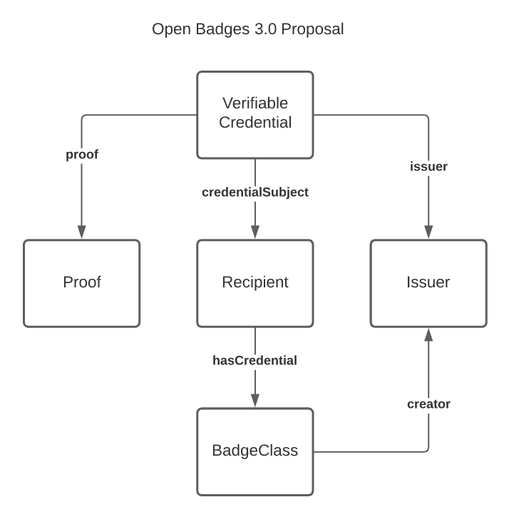

var specification = `

## Specification

### What is the problem this solves for?

Verifiable Credentials (VCs) are a format that is used to publish a limitless variety of claims about a subject person or other entity, typically through a cryptographic proof. VCs can be collected and delivered as part of a [presentation](https://www.w3.org/TR/vc-imp-guide/#dfn-verifiable-presentations) whereby authorship of each VC from the same or multiple issuers can be trusted via cryptographic verification. The presentation can also be cryptographically signed to demonstrate that the holder has assembled and sent the collection of VCs.

These layers of cryptographic proof can provide security and privacy enhancements to Open Badges that are not yet available in version 2.0. Adoption of Verifiable Credentials can increase market penetration and use of Open Badges by addressing market needs for trustworthy machine-ready data to power connected ecosystems in education and workforce. This can unlock the door for Open Badges credentials to be included in a growing number of multi-purpose digital credential wallets entering the market. Stepping further into signed VCs and another associated technology, decentralized identifiers (DIDs), unlocks increased longevity and resilience of Open Badges that can describe achievements even more expressively than they do today.

### What does adopting Verifiable Credentials entail?
This proposal is for a reasonable change to the structure of the Open Badges Assertion class, to adopt the conventions of the [Verifiable Credential Data Model](https://w3c.github.io/vc-data-model/). This means that badges issued under the proposed version would not be conformant to all of the existing 2.x data model requirements.

An existing Open Badges Assertion, illustrated in the graphic below, structures its objects like this:
An Assertion identifies a recipient with a "recipient" relationship to an IdentityObject that contains identifying properties. It identifies which badge it represents with a "badge" relationship to a BadgeClass. It identifies its verification information with a "verification" relationship to a VerificationObject. It identifies its issuer with an "issuer" relationship between the BadgeClass and the Issuer.

The proposed Verifiable Credentials structure depicted below offers the same information with a slightly different structure: A Verifiable Credential identifies its recipient with a "credentialSubject" relationship to a subject class that is identified by an identifier. It identifies its issuer with an "issuer" relationship directly to an Issuer. The Credential claims the subject has met the criteria of a specific BadgeClass (also known by its CLR alias as an "Achievement") with a "hasCredential" relationship to that defined achievement. It identifies its verification information with a "proof" relationship to an instance of a proof that follows a standardized schema.

## Benefits and Opportunities
It can be risky to make breaking changes to a specification used as broadly as Open Badges, but there are a range of benefits to making this move now while the Verifiable Credentials ecosystem is young and growing fast. There are strong use cases for digital credentials for learning and skill achievements across the nexus of education and employment, as we have seen from the broad adoption of Open Badges and the proliferation of industry groups making connections between educational institutions and the employment market around digital credentials. Technical compatibility is in a more favorable position when faced with rapid ecosystem growth than competition between large communities issuing these learning credentials and other communities focused on different market verticals from government identity documents, commercial payments, and international trade, to name a few.

This proposal opens a path forward for a unified concept of digital credentials in the IMS Global community, collapsing the relevant differences between Open Badges and CLR, and addressing a clear set of single achievement use cases with a robust, flexible, and future-proof solution that can easily be integrated with the set-of-multiple credentials use cases familiar to Comprehensive Learner Record.

Below, we present a selection of benefits related to the proposed restructuring of Open Badges, and compare the opportunities opened by becoming compatible with Verifiable Credentials to the limitations that the Open Badges community has encountered with today's version of Open Badges and CLR.

### Interoperability with Digital Wallets, Verifiable Presentations, and Learner Experiences
Open Badges as VCs are designed to be issued and offered to learners who may accept them into their digital wallet. Wallets are software that runs on either the web or as a native app on a mobile device or desktop environment. A web wallet is another term to describe the application role known under 2.0 as a "Host". There is an existing and growing ecosystem of deployed technology to support VCs; integration with these becomes possible if Open Badges adopts VCs along the lines of this proposal. For example, a number of generic Verifiable Credential wallet implementations are available from a variety of vendors as native mobile apps. From a wallet, recipients may package their badges along with their other VCs into verifiable presentations. A presentation contains the credentials that the learner wishes to share with a relying party. The digital wallet application digitally signs the presentation using the key of the learner. The verifying third-parties can cryptographically verify that the presentation came unmodified directly from the credential holder as well as the integrity of each of the VCs included in the presentation as credentials signed by each of their respective issuers.

It is possible from a wallet to package credentials into a verifiable presentation in response to a request from a relying party who seeks credentials for a certain purpose. For example, a potential employer seeking to fill an internship role, may need to verify that a student is over 18, has completed a course on communication, and is a current student. A student could use their wallet to package three VCs (driver's license, course completion badge, and student ID) into a presentation that is signed by their private key. When the presentation is sent to the employer's website, the employer can verify that the VCs belong to the student and that the VCs are authentic. Protocols and interoperability around making and fulfilling requests are still at an early stage, but when these technologies are tested in the wild, it would be a good idea to already have educational credentials claim schemas available for the claim types ("defined achievement" and "skill assertion") possible to make with Open Badges.

The growing collection of VC wallets is an example of how adopting a Verifiable Credentials-based approach allows Open Badges to grow in impact and take advantage of existing momentum in the digital credentials space around tooling that is entering the market and heading towards maturity.

### Verifiable Credentials Support Increases Learner Data Privacy and Trustworthiness of Open Badges

The [W3C Verifiable Credentials Data Model](https://w3c.github.io/vc-data-model/) specification describes how technologies can be used to present cryptographically verifiable and tamper-evident claims. Verifiable Credentials (VCs) can be verified through up-to-date and broadly interoperable schemas for verification. This can provide security and privacy enhancements to [IMS Global Open Badges](https://openbadgespec.org) that are not available in Open Badges 2.0.

Currently, Open Badges 2.0 data can be verified via either (a) publicly accessible hosted JSON badge data or (b) JWS digitally signed badges with a limited number of algorithms and key types, depending on the verification method chosen by the issuer. In order to keep up with evolving cryptographic standards without taking on the burden of writing cryptographic suites as a community not specializing in that function, adopting Verifiable Credentials proofs allows experts to update algorithms to keep up with improvements to cryptography-breaking processing power.

Publicly hosted badge data has been the preferred method of many Open Badges issuers. This method can risk the privacy of badge recipients who are reliant on the issuers to host their data leaving them with no direct control over its accessibility. There is also the potential that data about individuals is publicly accessible without their knowledge. Most Open Badges don't contain significant amounts of personally identifiable information, but they are subject to correlation. This could lead to on-site identification, email spam, and also cause badges to be correlatable with other personally identifying data on the web.

Hosted badge data is also not tamper-evident since it is hosted on web servers typically as dynamically-generated JSON files populated by queries made to relational databases or static JSON files. This makes the data easy to change without any historic reference or preservation. This can be convenient for issuers but not assuring for relying third-parties seeking to put the data to use. Changes to badge metadata such as criteria, the issuedOn date, and recipient email can reduce the perceived quality of data and reflect incorrect information about the learners' experiences. Digitally signed 2.0 badges provide more assurances and privacy than the hosted badges but are not commonly issued and are not interoperable with VC wallets.

There's been very little evidence that badge JSON data has been readily consumed by machines, but technologies and the education and workforce markets have evolved since Open Badges 2.0 was released 4 years ago. Machine learning and AI uses have expanded alongside blockchain and other decentralized technologies creating opportunity for connecting learners to opportunities, more accurate skills-based hiring, and updated curricula more equitably reflecting the needs of students. The market is demanding that the achievement data be trustworthy. This means that it should be accessible, protected, have integrity, and communicate what was intended including that the issuer and subjects of the data can be authenticated and that the data has not been tampered with since it was issued. Shifting Open Badges to align with the VC conventions to verify learner achievements meets these expectations and provides learners with more agency over their achievement data by giving them immediate access to it for as long as they need it, allowing them to choose which data they share, protecting it, and making it work with other credentials in and outside of education and workforce.

### Decentralized Identifiers and Self-Sovereign Identity
With Open Badges up to 2.0, email addresses have been used as identifiers far more commonly than the other available options. This has been problematic because email addresses may be used by more than one person, are often revoked when an individual leaves a job or school, are insecure, and aren't intended to be identifiers. Identifiers in VCs commonly are HTTP-based URLs, follow another scheme of IRI, or take the form of a [Decentralized Identifier](https://www.w3.org/TR/did-use-cases/#intro).

[Decentralized identifiers (DIDs)](https://www.w3.org/TR/did-core/) are a type of identifier for people, organizations and any other entity, where each identifier is controlled independently of centralized registries. Each DID can be resolved through an operation described by its particular "DID Method" to reveal a DID document that describes the subject. Whereas previous versions of Open Badges required HTTP(s) identifiers for issuers and typically used email (or rarely URL) identifiers for learners, adoption of the Verifiable Credentials Data Model provides simple conventions for badge issuers and recipients to begin to use DIDs when they desire.

Verification of control of identifiers is an important concept within any type of digital credential, both with respect to the issuer and the subject (recipient) of the credential. For issuers, Open Badges has relied on its own bespoke rules for determining whether a hosted Assertion URL or cryptographic key URL is associated with an issuer profile identified by a particular URL. URLs used for recipient identifiers have no built-in mechanism for authentication. Email and telephone number based recipient identifier authentication are up to the relying party, but there are common methods for performing this task essential to establishing trusted proof of control of credentials presented by a subject.

DIDs typically offer cryptographic proof of control, based on authorized keys or other verification methods expressed in the associated DID Document. While these protocols are not broadly implemented across domains today, the structure provides a forward-looking flexible and extensible mechanism to build the types of protocols needed to connect credentials back to the identities of their issuers and subjects. The Open Badges community may ultimately recommend use of only a small number of these capabilities in early releases or recommend them only for experimental use, like with cryptographic proof methods. But this is still an important step, because there is no reason for the Open Badges community to be closed to interoperability through the protocols being developed for use by the wallets and services coming into being elsewhere by delaying the option to use DIDs for recipient and issuer identifiers.

### Differentiating Issuers and Creators
In Open Badges 2.0, the issuer is assumed to be the creator. Over the years, the Open Badges community has requested capabilities to distinguish between the issuer and creator of a badge. This is because there are plenty of examples where the assessor is the issuer but not the creator of the badge. The [Original Creator Extensions](https://www.imsglobal.org/sites/default/files/Badges/OBv2p0Final/extensions/index.html#OriginalCreator) is a step in this direction but provides no properties to describe the eligibility of issuers trusted by the original creator to duplicate and issue their own assertions of the badge.

In order to open up a wide swath of use cases for shared issuing responsibility of common credentials, we must do more. Conveniently, an issuer property for the entity that is digitally signing the credential is included in the VC assertion. Because of this, the issuer property referenced in the BadgeClass is redundant. This property is a logical placement for new properties to describe a creator(s) and the eligibility of potential outside issuers to share or have delegated responsibility for badge issuance. This will enable the use cases and give relying third-parties more contextual information about the achievement and the parties involved.

### Achievement Types: Open Badges are More than Just Micro-credentials
The CLR provides a property, [achievementType](https://purl.imsglobal.org/spec/clr/v1p0/context/clr_v1p0.html#dtExtensibleAchievementType), that describes the type of achievement being represented. Open Badges 2.0 does not have a property to describe what type of achievement is being recognized. This has led to misconceptions that Open Badges are always micro-credentials. Including achievementType as property of the BadgeClass can clarify this misconception and refine interpretations of Open Badges by relying third-parties. This will increase the perceived significance and usage of Open Badges to deliver verifiable single achievements such as certifications, licenses, courses, etc.

### Results and Result Descriptions
The CLR Achievement class provides a property called [ResultDescription](https://purl.imsglobal.org/spec/clr/v1p0/context/clr_v1p0.html#dtResultDescription) which can describe possible levels of mastery associated to specific achievements. The Assertion class offers a "results" property which describes which of the possible outcomes was recognized. These levels of mastery may be aligned with rubrics and other rich skill descriptors hosted on networks such as IMS CASE, EMSI, and OSMT. Adding result descriptions to Open Badges can serve to associate single achievements with levels of mastery and skill descriptors to provide more contextual information about the achievements.

### Skill Assertions
Many of the use cases for Open Badges and CLR involve describing "defined achievements" with the Achievement/BadgeClass data class. These achievements may sometimes be aligned to skills or competencies, as a means of indicating that those who earn them have achieved the aligned skills. As part of this proposal, we also introduce the concept of a Skill Assertion, showing how the Open Badges Specification can be expanded to assert achievement of single skills in a more flexible manner that is complementary to these use cases and that opens up a wide range of new use cases. A Skill Assertion offers a lightweight structure for issuers to make a claim that a learner has a skill, with a particular assessment result if desired.

A Skill Assertion is an Open Badges assertion that contains a "skill result." The idea of a skill result fits perfectly with the concept from CLR of a Result that is paired against the ResultDescription defined in an Achievement/BadgeClass, but a skill result targets a skill that may have been defined by a third-party organization, such as an industry group. This is a separate claim that may be composed alongside a "hasCredential" claim that identifies which Achievement/BadgeClass criteria has been met, or it could appear in an Open Badges Verifiable Credential without the defined achievement claim. This means that an issuer could easily make an assertion that a learner has achieved the criteria of a certain badge, or that they have achieved a specific skill, or both (whether or not the skill is specifically identified in the alignments of the badge).

The following diagram shows how these concepts are connected for a use case in which an issuer asserts that a credential subject has achieved a particular skill, using a "results" claim to establish a relationship with a Result class that identifies which skill is recognized and may describe other aspects of the skill achievement, such as the level at which it was assessed and a degree of confidence. Specific use cases for how this data needs to be consumed will drive the specific skill-specific properties of the Result class that may be added to give issuers the options they need. In this example, a Skill Definition that is identified by a unique URL at which information about the skill is published is referenced by the Result. This pattern, named by the [Open Skills Network](https://openskillsnetwork.org) as a [Rich Skill Descriptor (RSD)](https://rsd.osmt.dev), makes it possible for skills to be precisely referenced in other entities, such as credentials. Here, the RSD was published by an industry organization, and included in this credential by a different issuer. There is no need for the skill author and the credential issuer to have a pre-existing or discoverable relationship in order for a Skill Assertion to be valid. Evidence may also be included, just like in any Assertion.

The notion of skill results can be combined with a defined achievement assertion claim "hasCredential". In this example, the same Skill Assertion appears, but additional criteria that the learner has met is described in the Achievement/BadgeClass as in many of our other examples. The Achievement aligns to the same skill that is recognized, but the Result allows the issuer to describe specifics about the assessment results relative to the skill.

The inclusion of Skill Assertion claims makes a natural, ergonomic fit with defined achievement claims and evidence claims. Business logic to process each of the available claims can look for just the data a relying party needs, and extraneous claims do not get in the way.

## Changes to the Data Model
Several changes to the Open Badges 2.0 data model are proposed, in order to accomplish the alignment with Verifiable Credentials and the above goals:

* **Align existing Open Badges VerificationObject properties with Verifiable Credential data model properties:** Verifiable Credentials have properties to describe an assertion of a claim and the instructions for cryptographically proving the claim. As seen in the examples below, some VC properties should replace the VerificationObject properties of Open Badges. For example, issuedOn will be replaced by [issuanceDate](https://www.w3.org/TR/vc-data-model/#issuance-date), expires by [expirationDate](https://www.w3.org/TR/vc-data-model/#expiration), and verification by [proof](https://www.w3.org/TR/vc-data-model/#proofs-signatures).

* **Image:** The Open Badges assertion has an optional image property which is expected to contain the badge metadata baked into an image. The 2.0 specification references the image in the BadgeClass and historically it has been expected that the baked image uses the BadgeClass image. In this model, the baking should continue to be optional as it is less needed with VCs. However, it is critical to note that the VC community is discussing methods of embedding verifiable data into files such as images, QR codes, and PDFs. This may not be ready for 3.0 but could be ready for a future version and referenced to encourage piloting. The BadgeClass image is required in 2.0. In 3.0, it should be optional. The baking of the badge was a proposed method of transporting Open Badges. This is not required with VCs. Some badge issuers may wish to include images in their badges for when they are being displayed online and some wallets may wish to put the images to use. Open Badges 3.0 should continue support for images to enable new uses for them to be adopted in future releases.

* **Add recipient to the credentialSubject.id:** VCs have credentialSubject which references the claim being being verified. The credentialSubject ID property can reference the subject of the credential. This property can contain a URI representing the subject which may be a URL or a DID. It should be discussed whether other profile properties could be optionally included in the credentialSubject.

* **Issuer & Credential Subject Identities:** With VCs, [issuer](https://www.w3.org/TR/vc-data-model/#issuer) and [credentialSubject](https://www.w3.org/TR/vc-data-model/#credential-subject) id properties must be a URI. This could be an HTTP-based URL or a [Decentralized Identifier](https://www.w3.org/TR/did-use-cases/#intro).

* **credentialSubject.schema:hasCredential:** The hasCredential property from schema.org is intended to contain the BadgeClass properties including name, description, criteria, etc. schema:hasCredential.id should contain the canonical url for the BadgeClass. schema:hasCredential.type identifies the properties as belonging to the BadgeClass.

* **credentialSubject.schema:hasCredential.achievementType:** This property is taken from the CLR and may contain the same string values as proposed by the CLR.

* **credentialSubject.schema:hasCredential.creator:** Open Badges as native VCs should continue to be one issuer of one claim about one recipient. With Open Badges, the issuer profile has been referenced in the BadgeClass. With Open Badges as VCs, the issuer is the entity that signs the credential. The issuer may be different from the creator of the badge being issued. As depicted in the example below, with Open Badges as VCs, the issuer profile may still include name, description, url, image, email, etc.

* **credentialSubject.evidence:** With OpenBadges up to 2.0, the evidence has been an assertion property. This proposal suggests that evidence should be included in the credentialSubject object so that the evidence is related to the claim, not the verification of the claim.

* **credentialSubject.resultDescription:** This property is taken from the CLR and may follow the same recommendations. As with evidence, this property should be included in the credentialSubject object.

* **Revoked Credentials:** VCs have a [credentialStatus](https://www.w3.org/TR/vc-data-model/#status) object. The id property must be a URL and the type property describes how the status of the credential may be checked.

* **Skill Assertion:** As depicted in the example below, this new type of Open Badge verifies a claim that a subject has attained a skill. In this instance, a credentialSubject.resultDescription would be required because it would reference the skill descriptor of the achieved skill. Evidence may be included to support the claim.

* **Verifiable Presentations:** One or more VCs can be combined into a [verifiable presentation](https://www.w3.org/TR/vc-data-model/#presentations) which is digitally signed by the presenter (typically the subject). A verifiable presentation is presented at the request of the verifier.  

### Changes to the Official Open Source Validator

This proposal will incur modifications to the validator and considerations as to how the validator handles prior versions of Open Badges and VC Open Badges. The working group can discuss topics such as whether validators should remain separate and if validated VC Open Badges should return VCs as receipts upon validation.

### Changes to the API

As with the validator, the BadgeConnect API will require adjustments to accommodate property changes. Conceptually, we will need to explore the flow and use cases of Open Badges as VCs.

### Considerations

* Learners may still share their badges online as HTML as they have in every version of Open Badges. Open Badges as VCs will be presented in response to verifiers requesting them from learner wallets. In addition to using badges for online portfolios, badges as VCs can be exchanged and evaluated as data.

* Issuers will need to adopt cryptographic signature strategies as recommended by the VC community.

## Examples

<figure class="example">
  <figcaption>Example of Open Badge as a Verifiable Credential</figcaption>
  <pre>
  {
    "@context": [
      "https://www.w3.org/2018/credentials/v1",
      "https://w3id.org/openbadges/v3"
      ],
      "type": [
        "VerifiableCredential",
        "Open Badge"
      ],
      "id": "https://website-that-supports-or-displays-the-badge.html",
      "issuer": {
        "id": "did:example:issuer",
        "name": "An Example Issuer",
        "image": "https://example.org/logo.png",
        "url": "https://example.org",
        "email": "contact@example.org"
      },
      "issuanceDate": "2010-01-01T19:23:24Z",
      "credentialSubject": {
        "id": "did:example:learner",
        "schema:hasCredential": {
          "id": "https://example.org/achievements/123",
          "type": "BadgeClass",
          "achievementType": "Certificate",
          "name": "Robotic Drones Analysis",
          "description": "Learn to analyze and present the different types of robotic drones",
          "image": "https://example.org/drone-image.png",
          "creator": "did:example:issuer",
          "criteria": "https://example.org/robotics-drone-analysis.html",
          "tags": ["robots", "not birds"],
          "alignment": [{
            "targetName": "CCSS.ELA-Literacy.RST.11-12.3",
            "targetUrl": "http://www.corestandards.org/ELA-Literacy/RST/11-12/3",
            "targetDescription": "Follow precisely a complex multistep procedure when carrying out experiments, taking measurements, or performing technical tasks; analyze the specific results based on explanations in the text.",
            "targetCode": "CCSS.ELA-Literacy.RST.11-12.3"
          }]
        },
        "resultDescriptions": [{
          "id": "urn:uuid:da72e42e-9f38-4c42-83ac-33f6cb9bb3b1",
          "name": "Mastery",
          "resultType": "PerformanceLevel",
          "rubricCriterionLevels": [{
            "id": "urn:uuid:24df3f14-4b9b-41b9-9e6b-d48798442425",
            "name": "Below Basic",
            "level": "Below Basic",
            "description": "The student made fewer than 3 citations"
            },
            {
            "id": "urn:uuid:c225be08-c67d-4ec8-ae8e-4860e83588ef",
            "name": "Basic",
            "level": "Basic",
            "description": "The student made 3-5 citations"
            },
            {
            "id": "urn:uuid:f256d3a9-c117-43bf-9e25-dc69691e18a1",
            "name": "Exceeds",
            "level": "Exceeds",
            "description": "The student made more than 5 citations"
          }]
        }],
        "evidence": {
          "id": "https://example.org/my-robot-drones-analysis.html",
          "name": "My Robot Drones Analysis",
          "description": "A paper in APA format analyzing five different types of robot drones that look like birds.",
          "narrative": "This research paper compared different types of robot drones that are sometimes mistaken for birds and their impacts on the environment.",
          "genre": "Journal Article"
        }
      },
      "proof": {
        "type": "RsaSignature2018",
        "created": "2017-06-18T21:19:10Z",
        "proofPurpose": "assertionMethod",
        "verificationMethod": "did:example:issuer#keys/1",
        "jws": "eyJhbGciOiJSUzI1NiIsImI2NCI6ZmFsc2UsImNyaXQiOlsiYjY0Il19..TCYt5X"
      }
    }
  </pre>
</figure>

<figure class="example">
  <figcaption>Example of two Open Badges as a Verifiable Credentials in a verifiable presentation by the learner</figcaption>
  <pre>
  {
    "@context": [
      "https://www.w3.org/2018/credentials/v1"
    ],
    "type": "VerifiablePresentation",

    "verifiableCredential": [{
      "@context": [
        "https://www.w3.org/2018/credentials/v1",
        "https://w3id.org/openbadges/v3"
        ],
        "type": [
          "VerifiableCredential",
          "Open Badge"
        ],
        "id": "https://website-that-supports-or-displays-the-badge.html",
        "issuer": {
          "id": "did:example:issuer",
          "name": "An Example Issuer",
          "image": "https://example.org/logo.png",
          "url": "https://example.org",
          "email": "contact@example.org"
        },
        "issuanceDate": "2010-01-01T19:23:24Z",
        "credentialSubject": {
          "id": "did:example:learner",
          "schema:hasCredential": {
            "id": "https://example.org/achievements/123",
            "type": "BadgeClass",
            "achievementType": "Certificate",
            "name": "Robotic Drones Analysis",
            "description": "Learn to analyze and present the different types of robotic drones",
            "image": "https://example.org/drone-image.png",
            "creator": "did:example:issuer",
            "criteria": "https://example.org/robotics-drone-analysis.html",
            "tags": ["robots", "not birds"],
            "alignment": [{
              "targetName": "CCSS.ELA-Literacy.RST.11-12.3",
              "targetUrl": "http://www.corestandards.org/ELA-Literacy/RST/11-12/3",
              "targetDescription": "Follow precisely a complex multistep procedure when carrying out experiments, taking measurements, or performing technical tasks; analyze the specific results based on explanations in the text.",
              "targetCode": "CCSS.ELA-Literacy.RST.11-12.3"
            }]
          },
        },
        "evidence": {
            "id": "https://example.org/my-robot-drones-analysis.html",
            "name": "My Robot Drones Analysis",
            "description": "A paper in APA format analyzing five different types of robot drones that look like birds.",
            "narrative": "This research paper compared different types of robot drones that are sometimes mistaken for birds and their impacts on the environment.",
            "genre": "Journal Article"
          },
        },
        "proof": {
          "type": "RsaSignature2018",
          "created": "2017-06-18T21:19:10Z",
          "proofPurpose": "assertionMethod",
          "verificationMethod": "did:example:issuer#keys/1",
          "jws": "eyJhbGciOiJSUzI1NiIsImI2NCI6ZmFsc2UsImNyaXQiOlsiYjY0Il19..TCYt5X
          sITJX1CxPCT8yAV-TVkIEq_PbChOMqsLfRoPsnsgw5WEuts01mq-pQy7UJiN5mgRxD-WUc
          X16dUEMGlv50aqzpqh4Qktb3rk-BuQy72IFLOqV0G_zS245-kronKb78cPN25DGlcTwLtj
          PAYuNzVBAh4vGHSrQyHUdBBPM"
        }
      },
      {
        "@context": [
          "https://www.w3.org/2018/credentials/v1",
          "https://w3id.org/openbadges/v3"
          ],
            "type": [
              "VerifiableCredential",
              "Open Badge"
            ],
            "id": "https://website-that-supports-or-displays-the-badge.html",
            "issuer": {
              "id": "did:example:issuer",
              "name": "An Example Issuer",
              "image": "https://example.org/logo.png",
              "url": "https://example.org",
              "email": "contact@example.org"
            },
            "issuanceDate": "2010-01-01T19:23:24Z",
            "credentialSubject": {
              "id": "did:example:learner",
                "schema:hasCredential": {
                  "id": "https://example.org/robot-badge/123",
                  "type": "BadgeClass",
                  "achievementType": "Badge",
                  "name": "Awesome Robotics Badge",
                  "description": "For doing awesome things with robots that people think is pretty great.",
                  "image": "https://example.org/robotics-badge.png",
                  "creator": "did:example:issuer",
                  "criteria": "https://example.org/robotics-badge.html"
                },
              },
              "evidence": [{
                "id": "https://example.org/beths-robot-photos.html",
                "name": "Robot Photoshoot",
                "description": "A gallery of photos of the student's robot",
                "genre": "Photography"
                },
                {
                  "id": "https://example.org/beths-robot-work.html",
                  "name": "Robotics Reflection #1",
                  "description": "Reflective writing about the first week of a robotics learning journey."
              }],
              "proof": {
                "type": "RsaSignature2018",
                "created": "2017-06-18T21:19:10Z",
                "proofPurpose": "assertionMethod",
                "verificationMethod": "did:example:issuer#keys/1",
                "jws": "eyJhbGciOiJSUzI1NiIsImI2NCI6ZmFsc2UsImNyaXQiOlsiYjY0Il19..TCYt5X
                sITJX1CxPCT8yAV-TVkIEq_PbChOMqsLfRoPsnsgw5WEuts01mq-pQy7UJiN5mgRxD-WUc
                X16dUEMGlv50aqzpqh4Qktb3rk-BuQy72IFLOqV0G_zS245-kronKb78cPN25DGlcTwLtj
                PAYuNzVBAh4vGHSrQyHUdBBPM"
              },
            }],    
          "proof": {
            "type": "RsaSignature2018",
            "created": "2018-09-14T21:19:10Z",
            "proofPurpose": "authentication",
            "verificationMethod": "did:example:learner#keys-1",
            "challenge": "1f44d55f-f161-4938-a659-f8026467f126",
            "domain": "4jt78h47fh47",
            "jws": "eyJhbGciOiJSUzI1NiIsImI2NCI6ZmFsc2UsImNyaXQiOlsiYjY0Il19..kTCYt5
            XsITJX1CxPCT8yAV-TVIw5WEuts01mq-pQy7UJiN5mgREEMGlv50aqzpqh4Qq_PbChOMqs
            LfRoPsnsgxD-WUcX16dUOqV0G_zS245-kronKb78cPktb3rk-BuQy72IFLN25DYuNzVBAh
            4vGHSrQyHUGlcTwLtjPAnKb78"
          }
        }
  </pre>
</figure>

<figure class="example">
<figcaption>Example of a Skill Assertion</figcaption>
  <pre>
  {
    "@context": [
      "https://www.w3.org/2018/credentials/v1",
      "https://w3id.org/openbadges/v3"
      ],
      "type": [
        "VerifiableCredential",
        "Open Badge"
      ],
      "issuer": {
        "id": "did:example:issuer",
        "name": "An Example Issuer",
        "url": "https://example.org"
      },
      "issuanceDate": "2010-01-01T19:23:24Z",
      "credentialSubject": {
        "id": "did:example:learner",
        "resultDescriptions": [{
          "id": "urn:uuid:da72e42e-9f38-4c42-83ac-33f6cb9bb3b1"
        }]
      },
      "proof": {
        "type": "RsaSignature2018",
        "created": "2017-06-18T21:19:10Z",
        "proofPurpose": "assertionMethod",
        "verificationMethod": "did:example:issuer#keys/1",
        "jws": "eyJhbGciOiJSUzI1NiIsImI2NCI6ZmFsc2UsImNyaXQiOlsiYjY0Il19..TCYt5X"
      }
    }
  </pre>
</figure>

`;
